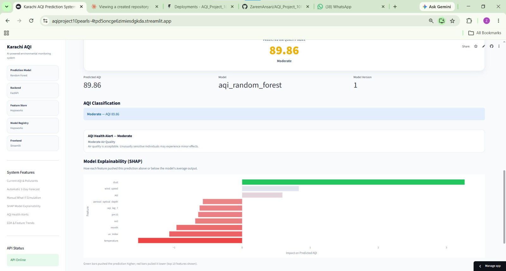
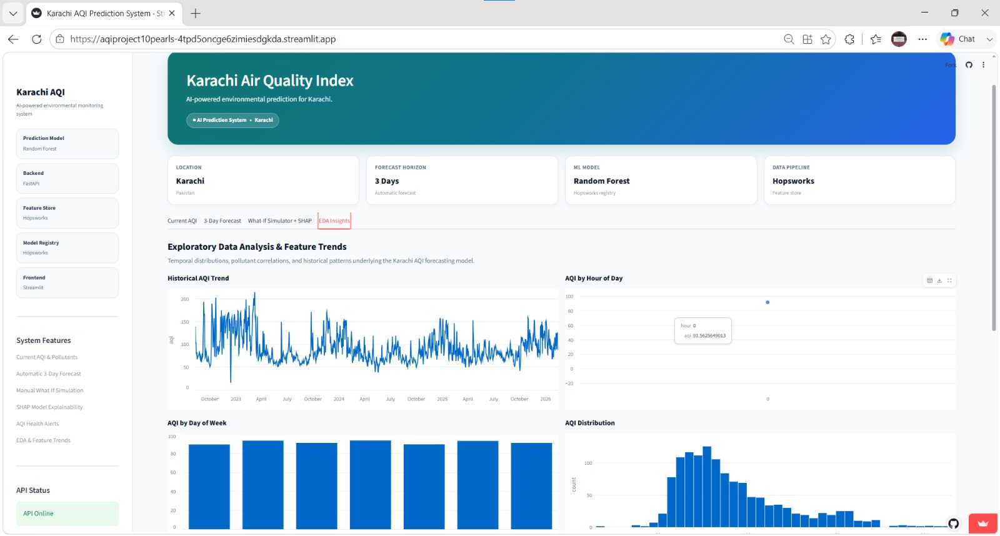

# Karachi AQI Prediction System

A machine learning app that predicts and forecasts Air Quality Index (AQI) for Karachi. Built around a Random Forest model, with Hopsworks handling the feature store and model registry, FastAPI serving predictions, and Streamlit as the frontend.

I built this to get hands-on with a full ML pipeline not just training a model in a notebook, but actually wiring up a feature store, versioning the model, exposing it through an API, and putting a real UI on top of it.

**Submitted by:** Zareen Ansari
**Program:** 10Pearls Shine Internship Program
**Institution:** 10Pearls Pakistan

---

## Table of Contents
- [Deployed Link](#deployed)
- [How It's Deployed](#how-its-deployed)
- [Overview](#overview)
- [Problem Statement & Objectives](#problem-statement--objectives)
- [Features](#features)
- [Tech Stack](#tech-stack)
- [System Architecture](#system-architecture)
- [Data & Feature Engineering](#data--feature-engineering)
- [Model & Methodology](#model--methodology)
- [Project Structure](#project-structure)
- [Setup & Installation](#setup--installation)
- [API Reference](#api-reference)
- [Results & Evaluation](#results--evaluation)
- [Screenshots](#screenshots)
- [Limitations](#limitations)
- [Implemented](#implemented)
- [Author](#author)

---
## Deployed

**Frontend (Streamlit UI):** https://aqiproject10pearls-4tpd5oncge6zimiesdgkda.streamlit.app/

**Backend (FastAPI API):** https://aqi-project-10pearls.fastapicloud.dev

## How It's Deployed

The app is split into two independently deployed services, so the frontend and backend can be redeployed, scaled, or debugged separately.

### Frontend — Streamlit Community Cloud

- Hosted for free on [Streamlit Community Cloud](https://share.streamlit.io).
- Connected directly to this GitHub repo — every push to `main` triggers an automatic redeploy.
- Only needs `requirements.txt`; no environment secrets required on this side, since all Hopsworks credentials live on the backend.
- The app's `API_URL` constant in `streamlit_app.py` points at the deployed FastAPI backend below rather than `localhost`.

### Backend — FastAPI Cloud

- Hosted on [FastAPI Cloud](https://fastapicloud.com), the official hosting platform from the FastAPI team, using their free Hobby tier.
- Deployed via the FastAPI CLI rather than a Dockerfile:

  ```bash
  # one-time setup
  pip install "fastapi[standard]"
  fastapi cloud login
  fastapi cloud apps create --link

  # set secrets (Hopsworks credentials never touch the repo)
  fastapi cloud env set --secret HOPSWORKS_API_KEY "your-api-key"
  fastapi cloud env set --secret HOPSWORKS_PROJECT "your-project-name"

  # deploy
  fastapi deploy
  ```
- A `.python-version` file pins the Python version (`3.12`) so the build resolves pre-built wheels for `pandas`/`scikit-learn` instead of compiling them from source.
- On startup, the backend logs into Hopsworks, downloads the registered Random Forest model, and builds a SHAP `TreeExplainer` for the explainability endpoint.

## Overview

Air pollution is a persistent problem in Karachi, and reliable, easy-to-read AQI information isn't always available in a timely way. This project is a small end-to-end ML system that predicts the current and near-future Air Quality Index based on pollutant concentrations, weather variables, and time-based features. It supports live current-conditions monitoring, an automatic 3-day forecast, a manual "what-if" mode with model explainability, and exploratory data analysis of the underlying training data.

## Problem Statement & Objectives

There's a need for a lightweight, self-contained system that can 
- (a) report current AQI from live environmental readings,
- (b) predict AQI from a given set of environmental readings, and 
- (c) forecast AQI a few days ahead using recent trends without requiring the user to understand the model underneath.

Goals for this project:

- Collect and engineer relevant pollutant, weather, and time-based features for AQI prediction.
- Train and evaluate multiple models and best model was Random Forest Regressor.
- Version and serve the trained model using a feature store / model registry (Hopsworks).
- Expose the model through a REST API (FastAPI) with current, prediction, forecast, and explainability endpoints.
- Build an interactive frontend (Streamlit) for live monitoring, automatic forecasting, manual scenario testing, and data exploration.
- Evaluate accuracy and usability, and document limitations honestly rather than overselling the result.

## Features

- **Current AQI tab**: live pollutant readings (PM2.5, PM10, Ozone, NO2, CO, SO2) pulled from Open-Meteo, combined with the model's real-time predicted AQI shown on a gauge.
- **3-Day Forecast tab**: pulls the latest environmental data automatically and shows a 3-day AQI forecast with daily cards, a trend chart, and a health advisory.
- **What-If Simulator tab**: lets you manually enter pollutant levels, weather conditions, and time features to see what the model predicts for a custom scenario.
- **SHAP Model Explainability**: after every What-If prediction, a SHAP bar chart shows which features pushed the predicted AQI up (green) or down (red), and by how much.
- **EDA Insights tab**: historical AQI trend, AQI by hour of day, AQI by day of week, an AQI distribution histogram, and summary statistics computed directly from the training dataset.
- Health alerts that change based on the predicted AQI band (Good → Hazardous), using standard AQI category thresholds.

## Tech Stack

| Layer | Tool |
|---|---|
| Model | Random Forest (scikit-learn) |
| Explainability | SHAP (TreeExplainer) |
| Feature Store & Model Registry | Hopsworks |
| Backend API | FastAPI |
| Frontend | Streamlit |
| Charts / Visualization | Plotly |
| Backend Hosting | FastAPI Cloud |
| Frontend Hosting | Streamlit Community Cloud |
| Data source |  Zenodo.org, Aqicn.org |

## System Architecture

The system follows a standard ML-serving pipeline with four main components:

```
Environmental data source
        │
        ▼
Hopsworks Feature Store  ──►  Model training  ──►  Hopsworks Model Registry
                                                                  │
                                                                  ▼
                                          FastAPI (/current, /predict, /forecast, /shap, /health)
                                          hosted on FastAPI Cloud
                                                                  │
                                                                  ▼
                                          Streamlit UI (this repo)
                                          hosted on Streamlit Community Cloud
```

Data flows one direction at inference time: the Streamlit app never talks to Hopsworks directly. Every read and prediction goes through the FastAPI layer, which keeps the frontend simple and keeps credentials off the client. In production, Streamlit Community Cloud and FastAPI Cloud each host their own piece independently, communicating only over HTTPS.

## Data & Feature Engineering

**Data source:** Zenodo.org, Aqicn.org

**Features used:**

| Category | Features |
|---|---|
| Pollutants | PM10, PM2.5, CO, NO2, SO2, O3 |
| Atmospheric | Aerosol Optical Depth, Dust, UV Index |
| AQI context | Current AQI, European AQI |
| Time features | Hour, Day, Month, Weekday |
| History / trend | AQI Change Rate, AQI Lag 1, AQI Lag 7 |
| Weather | Temperature, Humidity, Wind Speed, Rain |


## Model & Methodology

Random Forest regression was chosen because it handles non-linear relationships between pollutants and AQI reasonably well, needs relatively little feature scaling, and is robust to the kind of noisy readings you get from environmental sensors.

| Model | RMSE | MAE | R² |
|---|---:|---:|---:|
| Ridge Regression | 28.1912 | 22.4450 | 0.1029 |
| Random Forest | 24.1779 | 17.2996 | 0.3402 |
| XGBoost | 25.0515 | 17.4762 | 0.2916 |
| LSTM | 30.3105 | 23.8073 | -0.0002 | Random Forest was best among these models.

**Training pipeline:** Features are engineered and written to the Hopsworks Feature Store. The Random Forest model is trained on this feature set and, once evaluated, registered to the Hopsworks Model Registry along with its version number, so the serving layer always pulls a known, reproducible model rather than whatever's sitting in a local file.

**Explainability:** On startup, the backend also builds a SHAP `TreeExplainer` around the loaded Random Forest model, so every What-If prediction can be paired with a per-feature contribution breakdown without retraining or refitting anything.

**Hyperparameters:** max_depth=20, n_estimators=300, random_state=42, gridsearchcv=5.

## Project Structure

```
.
├── streamlit_app.py          # frontend (Current AQI, Forecast, What-If + SHAP, EDA tabs)
├── app.py                    # FastAPI backend (endpoints, model loading, SHAP explainer)
├── pipelines/                # feature engineering / training pipeline
├── karachi_aqi_final_features.csv  # training dataset, used by the EDA tab
├── .python-version           # pins Python version for FastAPI Cloud builds
├── requirements.txt
└── README.md
```


## Setup & Installation

This assumes FastAPI and Streamlit run side by side — e.g. in a GitHub Codespace or two terminal tabs locally.

1. Clone the repo and install dependencies:
   ```bash
   git clone https://github.com/ZareenAnsari/AQI_Project_10Pearls
   cd AQI_Project_10Pearls
   pip install -r requirements.txt
   ```

2. Add a `.env` file with your Hopsworks credentials (never committed to the repo):
   ```
   HOPSWORKS_API_KEY=your-api-key
   HOPSWORKS_PROJECT=your-project-name
   ```

3. Start the backend:
   ```bash
   uvicorn app:app --host 0.0.0.0 --port 8000
   ```

4. In a separate terminal, start the frontend:
   ```bash
   streamlit run streamlit_app.py
   ```

For deploying to production instead of running locally, see [How It's Deployed](#how-its-deployed) above.

## API Reference

| Endpoint | Method | Purpose |
|---|---|---|
| `/health` | GET | Reports API status and whether the model and SHAP explainer loaded successfully |
| `/current` | GET | Returns live pollutant readings and the model's real-time predicted AQI |
| `/forecast?days=3` | GET | Returns a multi-day AQI forecast |
| `/predict` | POST | Accepts a JSON payload of features and returns a single AQI prediction |
| `/shap` | POST | Accepts the same payload as `/predict` and returns per-feature SHAP contributions for that prediction |

Example `/predict` payload:
```json
{
  "pm10": 45.0,
  "pm25": 30.0,
  "co": 0.5,
  "no2": 20.0,
  "so2": 5.0,
  "o3": 30.0,
  "aerosol_optical_depth": 0.3,
  "dust": 0.2,
  "uv_index": 5.0,
  "aqi": 70.0,
  "european_aqi": 70.0,
  "hour": 12,
  "day": 11,
  "month": 8,
  "weekday": 2,
  "aqi_change_rate": 0.0,
  "aqi_lag_1": 70.0,
  "aqi_lag_7": 65.0,
  "temperature": 32.0,
  "humidity": 50.0,
  "wind_speed": 10.0,
  "rain": 0.0
}
```

## Results & Evaluation

| Metric | Value |
|---|---|
| Mean Absolute Error (MAE) | 17.299552 |
| Root Mean Squared Error (RMSE) | 24.177871 |
| R² Score | 0.340159 |


## Screenshots

### Current AQI


### What-If Simulator + SHAP



### EDA Insights



## Limitations

- The forecast depends on how fresh the feature store data is if the upstream data source lags, forecasts can be stale.
- Currently trained/tuned for Karachi specifically; feature ranges (e.g. dust, aerosol optical depth).
- No authentication on the FastAPI endpoints fine for a local/demo setup, not production-ready as-is.
- The FastAPI Cloud free tier (0.1 vCPU / 512 MB shared) can be tight given Hopsworks, pandas, scikit-learn, and SHAP all loaded together — cold starts or occasional slow responses are possible on the free tier.

## Implemented

- Automate retraining on a schedule instead of manually re-running the pipeline.
- Compare Random Forest against gradient-boosted models (XGBoost/LightGBM).
- Cache forecast results so repeated refreshes don't always hit the feature store.
- Extend the forecast horizon beyond 3 days and validate accuracy at longer horizons.


## Author

Zareen Ansari — zareenansari918@gmail.com / (https://www.linkedin.com/in/zareenansari/)

##  Complete System Architecture

```text
                    AQI / Environmental Data
                              │
                              ▼
                    ┌───────────────────┐
                    │ Data Preprocessing│
                    └─────────┬─────────┘
                              │
                              ▼
                    ┌───────────────────┐
                    │ Feature Engineering│
                    └─────────┬─────────┘
                              │
                              ▼
                    ┌───────────────────┐
                    │ ML Model Training │
                    └─────────┬─────────┘
                              │
                              ▼
                    ┌───────────────────┐
                    │ Model Evaluation  │
                    └─────────┬─────────┘
                              │
                              ▼
                    ┌───────────────────┐
                    │   Best ML Model   │
                    │ (FastAPI Cloud)   │
                    └─────────┬─────────┘
                              │
        ┌──────────┬─────────┼─────────┬──────────┐
        │          │         │         │          │
        ▼          ▼         ▼         ▼          ▼
     Current      AQI       SHAP      Health      EDA
      AQI      Prediction Explanation  Alert     Insights
        │          │         │         │          │
        └──────────┴─────────┼─────────┴──────────┘
                              │
                              ▼
                    ┌───────────────────┐
                    │ Streamlit Dashboard│
                    │ (Streamlit Cloud) │
                    └───────────────────┘
```
